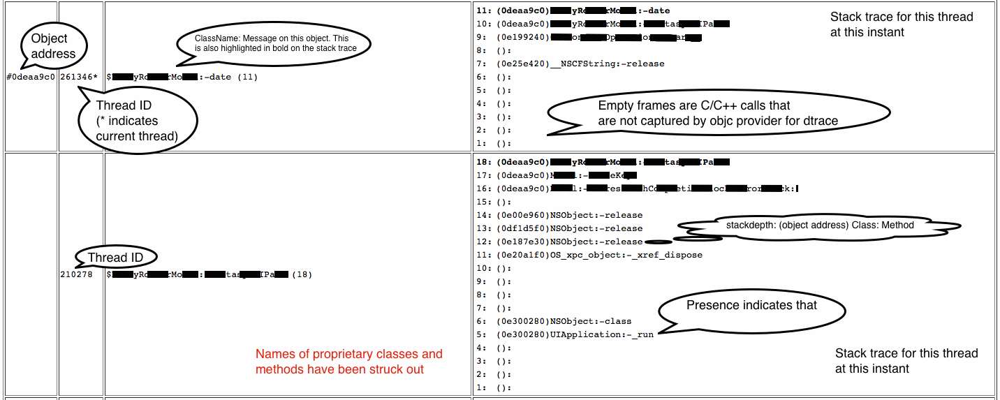

#ThreadAnalyzer
##Overview
It is very common to encounter situations where a non-thread safe object is accessed simulataneously by two or more threads. Crashes or unexpected behavior ensuing such access is often difficult to detect and even more difficult to prove.

Our initial intent was to create a tool which would detect and explicitly mark each user defined class in the application as __thread safe__ or __thread unsafe__. We aimed to do so using reflection. This required us to develop a way to detect simultaneous access of an object my multiple threads and to classify such access, heurestically, as thread safe or thread unsafe. Armed with this knowledge, we would then go ahead and mark the classes appropriately.

This tool is thus designed to highlight such simultaneous access and identify potential causes of thread safety violation in your application. As input the tool expects output from dtrace - a kernel level tracing utility which can be used to capture every message sent (method call/access) to an object during the lifetime of application. When run without any other input, the tool highlights all concurrent object access throughout the lifetime of the application. Custom whitelists - files containing lists of known thread safe classes and functions - can also be supplied to the tool in order to exclude these from the analysis. Since dtrace can be attached to any running application, you can use this tool to identify concurrent access in any application, and not just iOS applications.

Currently, this tool outputs the results of the analysis in the form of a html file - details about how to interprete it are provided below. 

In subsequent relese we would add the functionality of marking the class explicitly as thread safe/unsafe - the original motivation behind developing this tool.

##Requirements
* You must be running Mac OS X 10.9 or later with Xcode 5 or later
* Must have sudo privileges

##Installation
1. Download the 'CocoaSanitizer/Release/ThreadAnalyzer' folder (downloading the project source is totally optional)
2. (OPTIONAL) Download the 'CocoaSanitizer/Release/DumpClassNames' folder and copy the 'DumpClassNames' tool to the folder downloaded above.

##Usage
###Using shell script (Recommended)
* The CocoaSanitizer/Release/ThreadAnalyzer directory should have the binary, a shell script, a dtrace script and white list files you need to run the analysis. 
* If you downloaded the DumpClassNames tool you may execute it first and generate an output file with names of all classes defined in the application in order to enable filtering based on user classes in your analysis (-u switch). Enabling this switch would include only those stack traces in the analysis for which there is at least one frame where a user defined class is messaged. This allows us to filter out purely OS based cross thread calls - uninteresting to our analysis.
* You may choose to modify the default whitelist files, or supply your own to the shell script.  

* The shell script takes the following arguments:
```
traceAndAnalyze.sh {-p pid | -P application_name.app} [-n niceValue] [-c classWhiteList] [-f functionWhiteList] [-u userClassList] [-b bufferSize] [-s switchRate] [-w {YES(default) | NO}] [-h]
```
		
	* At least -p or -P option must be used. Other parameters are optional. 
	* The -w parameter controls whether or not whitelists will be used for analysis. 
		- It is turned on by default. 
		- If you wish to turn it off, just pass ```-w NO```, and any use of -c, -f and -u will be ignored.
		- The if -c and/or -f switches aren't used, the default whitelists in the bin folder are automatically supplied.
		- Use -u switch to supply a file with list of all classes defined in the application (use DumpClassNames to get this list). 
	* The default value for bufferSize is 32MB
	* The default value for switchRate is 16Hz
	* The default value for nice is 10

####Steps to run
* Create a breakpoint in the main() of your iOS project
* Launch the application in simulator, it should immediately pause at the breakpoint
* Open a terminal window to execute the shell script from the release directory, and continue the execution of your app in XCode. Example:

```
$./traceAndAnalyze.sh -P "Y\! Finance.app" -n20 -c moduleWhiteList.txt -f functionWhiteList.txt -u finance_classnames.txt -b 32 -s 20
```

* At this point the trace will be active.  Go ahead and 'continue' past the breakpoint, and exercise your application.  The resulting report data will only be as good as the tests you perform, so try to test a good amount of functionality in your app.
* When you're done exercising the app, go ahead and 'stop' the app in the debugger.
* At this point the script should begin generating the report based on the trace data (which could take awhile)

###Output
The output will be in the form of a .html file and a summary (.txt) file, both created in the same directory from which you ran the shell script.

The summary file will list total number of objects and threads that existed during lifetime of the application. It will also list all classes that potentially access these objects in thread unsafe manner.

The .html file will show potential violations in the form of a table. An example in provided below. Here we can see two threads trying to access the same object simultaneously.



##Other Notes
###Running different commands individually
While it is recommended to use the shell script for analysis, since it runs dtrace, sort and threadAnalyzer on your behalf, there may be occassions when you want to execute each step separately.

####Running dtrace
1. Create a breakpoint in the main() of your iOS project
2. Launch the application in simulator, it should immediately pause at the breakpoint
3. Open a terminal window to run the following command, and continue the execution of your app in XCode

```
$sudo dtrace -s message_tracker.d -q -b buff_size -x switchrate=switch_rate -p `ps -ae | grep "application_name.app" | sed 's/^ *//' | cut -d ' ' -f1` > output.txt
```
Example:
```
$sudo dtrace -s message_tracker.d -q -b 32m -x switchrate=10hz -p `ps -ae | grep "Y\! Finance.app" | head -n1 | sed 's/^ *//' | cut -d ' ' -f1` > finance_`date +%m%d%y_%H%M%S`.txt
```


####Sorting the output file
```
$sort -n output.txt > sorted_output.txt
```

####Running ThreadAnalyzer
*While the order of other arguments doesn't matter, trace_file must be the __last__ argument to ThreadAnalyzer*
```
$./ThreadAnalyzer [-f file_function_white_list] [-c file_class_white_list] [-u file_user_defined_classes] trace_file
```
Example:
	
```
$./ThreadAnalyzer -f functionWhiteList.txt -c moduleWhiteList.txt -u finance_classNames.txt sorted_output.txt
```

___
###Troubleshooting
####If you face drops at cpu
If you face drops at CPU while using dtrace, it means that messages are being generated (and captured) at a rate faster than dtrace can write it to disk.
The output generated will thus be an inaccurate representation of the application run, and can also result in false positives in the analysis.
There are multiple ways you can try to fix this, these are documented below.    
* Try increasing buffer size and/or switchrate.
* Try making your process "nice". The following command reduces the priority of your application, thereby giving dtrace time to breathe.

```
$sudo renice new_priority process_id
```
Example:
```
$sudo renice 10 `ps -ae | grep "Y\! Finance.app" | head -n1 | sed 's/^ *//' | cut -d ' ' -f1
````

##Building from Source
* Download all files under 'CocoaSanitizer/Source/ThreadAnalyzer' to similar path structure on your machine
* Compile in Xcode
* The output binary and support files will be automatically copied to 'CocoaSanitizer/Release/ThreadAnalyzer'

##Contact
Brian Tunning (iOS Engineer)
Kalpesh Padia (iOS Engineer) <br />
